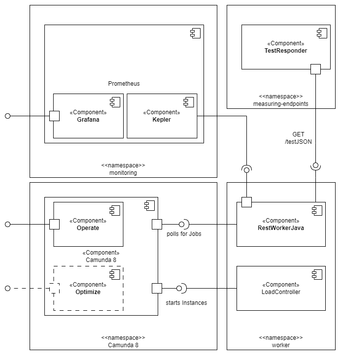
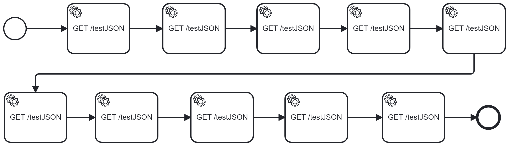

# Energieeffizienz Analyse: Camunda Worker

Dieses Repository beinhaltet eine Messumgebung zur Analyse von Camunda-Workern mittels Kepler. Es basiert auf der [BPMN-Demo-App](https://gitlab.com/envite-consulting/sustainable-software-architecture/hackathon/bpmn-demo)

## Problemstellung/Motivation

IT-Systeme so zu entwickeln und zu konfigurieren, dass sie für ihren Einsatzzweck möglichst wenig Energie verbrauchen, ist eine wichtige Aufgabe, die in der Vergangenheit nicht immer die nötige Aufmerksamkeit erfahren hat. Einerseits lassen sich die laufenden Kosten für Unternehmen so reduzieren, andererseits (und deutlich dringlicher) stellt eine solche Optimierung auch einen elementaren Beitrag an der gesamtgesellschaftlichen Transformation dar, die es braucht, um der Klimakrise Einhalt zu gebieten.
Jede Komponente bestehender Systeme muss also auf ihre Effizienz hin überprüft werden. Die entstandenen Erkenntnisse und Best-Practices sollten dann mit Nachdruck Einzug in die zu optimierenden IT-Systeme halten. 

## Messumgebung



Damit das Fundament der Messumgebung eine gewisse Nähe zu Produktionsumgebungen hat, finden alle Messungen in einem Kubernetes-Cluster (umgesetzt mit k3s) auf einem Ubuntu-System statt. Um den Stromverbrauch der Worker zu erfassen, kommt Kepler zum Einsatz, exportiert an Prometheus und visualisiert in Grafana. 
Die Prozessapplikation besteht aktuell aus zwei Komponenten - ``LoadController`` und ``restworkerjava``. ``LoadController`` erzeugt in gewissem Takt eine bestimmte Menge paralleler Instanzen eines Prozesses und generiert so Last, unter welcher ``restworkerjava``  dann gemessen werden kann.

`restworkerjava` stellt die Worker-Implementierung dar, die analysiert werden soll und deren Verbrauchswerte das Herz der Messungen sind. 
In der aktuellen Konfiguration arbeitet der Worker `restworkerjava` Jobs vom Typ ``fetch-json`` ab, die `typical_payload.json`, entliehen aus dem [[Github - camunda-8-benchmark|Camunda 8 Benchmark Projekt]] per REST anfragen und empfangen. Als Gegenpunkt der REST-Anfragen steht im gleichen Cluster der ``testResponder`` bereit, eine Spring-Applikation, die nach einer Verzögerung von 100ms das entsprechende JSON zurückschickt. 

Im Fokus der Messungen stehen vier Parameter, mit denen das Verhalten der Worker konfiguriert werden kann:

- `maxJobsActive`: Die Anzahl an Jobs, die von einem Worker parallel eingeholt und abgearbeitet werden können
- `pollInterval`: Das Intervall, in welchem ein Worker nach neuen Jobs fragt 
- `timeout`:  Die Zeit, die Zeebe abwartet, bevor der vergebene Job wieder von Zeebe als offen vermerkt wird
- `requestTimeout`: Die Zeit, die der Worker auf Antwort von Zeebe wartet, bevor die aktuelle Anfrage geschlossen wird (s. Long-Polling)

Dieser Aufbau bildet die Grundlage für eine Reihe von Messungen, die zum Ziel haben, den Einfluss auf den Stromverbrauch von `restworkerjava` zunächst statisch und isoliert zu betrachten, um danach dynamische und komplexere Szenarien zu analysieren. 

Neben der Menge an Strom, die der Worker verbraucht hat, sollen weitere Metriken hinzugezogen werden. Zunächst wird nur Anfangs- und Endzeiten des Load-Tests betrachtet, je nach Messkonfiguration können sind aber weitere Metriken denkbar bzw. notwendig.

## Andere Systemparameter

Logischerweise haben viele andere Faktoren auch Einfluss auf die Energieeffizienz des Workers in diesem System. Die Implementierung selbst, die gewählte Programmiersprache oder die Kubernetes-Konfiguration sind neben vielem Anderen interessant, fallen für diese Arbeit allerdings nur bedingt in die Betrachtung. Für diese Faktoren wurden statische Konfigurationen angenommen, die durch Best-Practices (bspw. vorgegeben durch Camunda) oder andere Zwängen (bspw. Vertrautheit der EntwicklerInnen mit Technologien) vordefiniert sind.

## Usage

### Getting Started

#### Installation

s. [BPMN-Demo Readme](README-BPMN-Demo.md)

**Wichtig:** Für dieses Repo sind alle AWS-Komponenten entfernt worden, der Fokus liegt auf lokaler Entwicklung. 

#### Port-Forwarding

**Zeebe**:
`kubectl port-forward -n camunda8 svc/camunda-platform-zeebe-gateway 26500:26500`

**Operate**
`kubectl port-forward -n camunda8 svc/camunda-platform-operate  8082:80`

**Tasklist**
`kubectl port-forward -n camunda8 svc/camunda-platform-tasklist 8083:80`

**TestResponder**
`kubectl port-forward svc/measuring-endpoints 8090:8090`

**Grafana**
`kubectl port-forward -n monitoring svc/kube-prometheus-stackr-grafana 9104:80`

### Prozessmodelle

Die entsprechenden Prozessmodelle müssen im Camunda-System deployed sein, ihr Name kann dann per Umgebungsvariable übermittelt werden.

Der Prozess `benchmark_small` (s.o.) erstellt 10 Jobs vom Typ `fetch-json` 
### Parameter ``LoadController``

zu finden unter `configs/load-controller-values.yaml`

```yaml
gatewayAddress: camunda-platform-zeebe-gateway.camunda8:26500
processName: benchmark_small # name of deployed (!) process model
sleepDuration: 10 # interval between waves in s
parallelInstances : 1 # how many instances to start per wave
					# Number of waves = instanceCount / parallelInstances 
instanceCount: 10 # total number of started instances 
```

Veränderte Parameter können mittels `terraform apply` angewandt werden. Zur erneuten Ausführung den Pod löschen und Kubernetes einen neuen erstellen lassen. Eine nutzerfreundlichere Implementierung zum Neustart soll in Zukunft nachgeliefert werden. 
### Parameter `restworkerjava`

zu finden unter `configs/restworkerjava-values.yaml`

``` yaml
gatewayAddress: camunda-platform-zeebe-gateway.camunda8:26500
testResponderAddress: measuring-endpoints.measuring-endpoints.svc.cluster.local:8090
maxjobsactive: 32 # maximum number of jobs a worker will claim
pollinterval: 2 # seconds before polling again 
timeout: 45 # seconds before zeebe reopens job
requestTimeout: 30 # seconds before closing long poll and polling again. 
				# -1 to deactivate long polling
				# 0 to use zeebe default value
```


